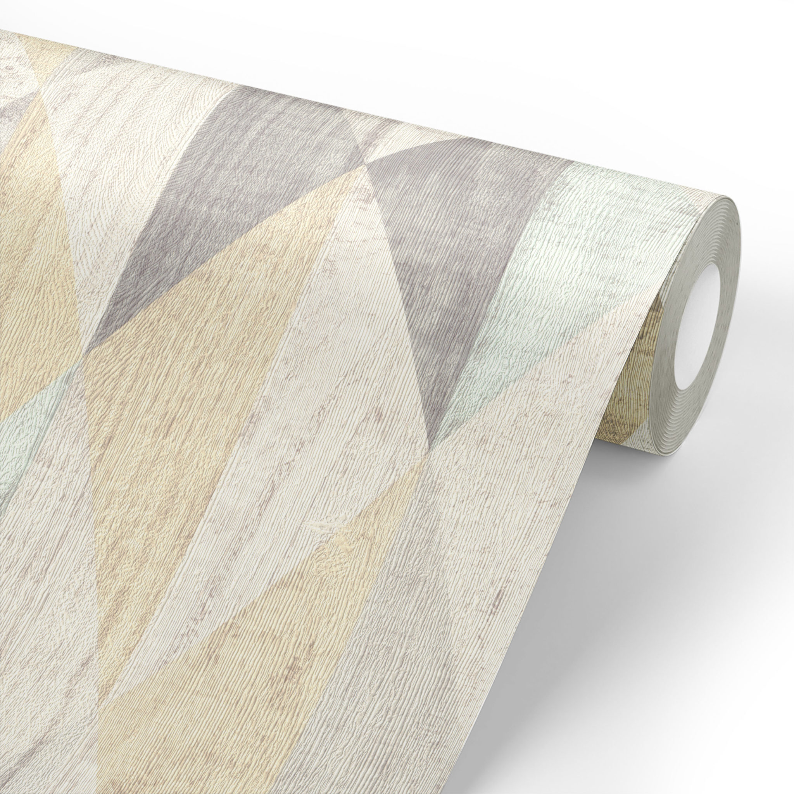

# pkhlunev.github.io
<!DOCTYPE html>
<html lang="ru">
<head>
    <meta charset="UTF-8">
    <meta http-equiv="X-UA-Compatible" content="IE=edge">
    <meta name="viewport" content="width=device-width, initial-scale=1.0">
    <title>Document</title>
    <link rel="stylesheet" href="style.css" />
</head>
<body>
    
    <h1>Расчет количества рулонов</h1> 
    

        <a href="index2.html" class = "whycountwords">Принцип расчета</a>
        <a href='index3.html' class = 'countitwords'>Рассчитать количество рулонов</a>
        <a href="index4.html" class  = "helpme">Обратная связь</a>
    

</body>

</html>
<!DOCTYPE html>
<html lang="en">
<head>
    <meta charset="UTF-8">
    <meta http-equiv="X-UA-Compatible" content="IE=edge">
    <meta name="viewport" content="width=device-width, initial-scale=1.0">
    <link rel="stylesheet" href="style.css" />
    <title>Document</title>
</head>
<body>
    

        
        Принцип расчета
        Вероятно, некоторые задаются вопросом "А как же именно производятся расчеты?" В этой статье вы узнаете все подробности об этом.
        После ввода значений "длина" и "ширина" в метрах, вычисляется периметр по формуле : <b>(длина + ширина)*2</b>. Следующим шаг программы - вычисление площади помещения. Для этого используется уже найденный <i>периметр</i> помещения и высота помещения, введенная пользоватедем. Формула рассчетов : <b>Периметр * высота</b>
        Предпоследний этап программы - вычисление <i>площади рулона</i>. После того, как пользователь вводит длину и ширину, используется формула : <b>длина рулона * ширина рулона</b> 
        Наконец, заключительный этап программы - на основе всех полученных данных кол-во рулонов определяется по следующей формуле : <b>Площадь помещения / площадь рулона.</b> Чтобы цифры не выскочили за пределы разумного, у всех параметров стоит округление лишь до 2 знаков после запятой, у кол-ва рулонов - до одного знака.

    

</body>
</html>
<!DOCTYPE html>
<html lang="ru">
<head>
    <meta charset="UTF-8">
    <meta http-equiv="X-UA-Compatible" content="IE=edge">
    <meta name="viewport" content="width=device-width, initial-scale=1.0">
    <title>Document</title>
    <link rel="stylesheet" href="style.css" />
</head>
<body>
    

        
        Рассчитать количество рулонов   
        Иногда нам бывает необходимо рассчитать количество рулонов обоев для покупки. Можно сделать это вручную, а можно воспользоваться этим онлайн калькулятором, заполнив все необходимые поля за минуту и быстро получив результат.
        <b class = 'index3attentionbold'>Внимание!</b>Если программа показывает десятичное число рулонов, то округляйте до целого. Например, 7.3 ==> 8
        <input type = "number" placeholder = 'Введите длину помещения(в "м")' class = "enterheight"></input>
        <input type = "number" placeholder = 'Введите ширину помещения( в "м")' class = "enterwidth"></input>
        <input type = "number" placeholder = 'Введите высоту помещения(в "м")' class = "entertop"></input>
        <input type = 'number' placeholder = 'Введите ширину рулона (в "м")'class ='enterrulonwidth'></input>
        <input type = 'number' placeholder = 'Введите длину рулона (в "м")' class = 'enterrulonheight'></input>
        Периметр вашего помещения :
        Площадь вашего помещения:
        Площадь вашего рулона:
        Необходимое количество рулонов:
        <button class = 'countitnow'>Рассчитать</button>
    

</body>

</html>
<!DOCTYPE html>
<html lang="en">
<head>
    <meta charset="UTF-8">
    <meta http-equiv="X-UA-Compatible" content="IE=edge">
    <meta name="viewport" content="width=device-width, initial-scale=1.0">
    <link rel="stylesheet" href="style.css" />
    <title>Document</title>
</head>
<body>
    
    Обратная связь
    По вопросам работы сайта и техподдержки обращайтесь на почту pkhlunev@gmail.com
</body>
</html>
